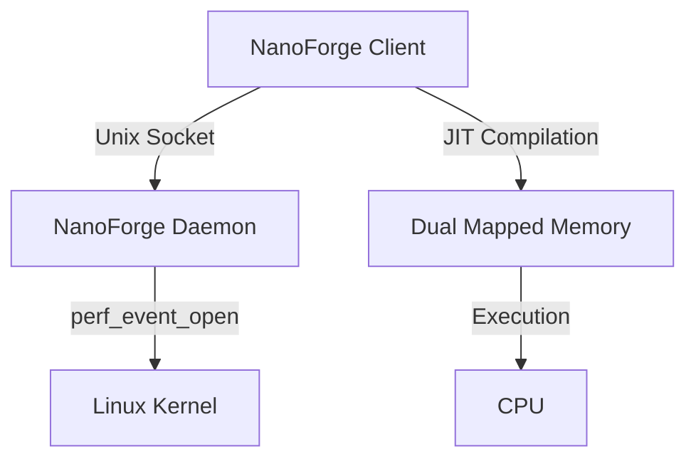

# NanoForge: Self-Optimizing Assembly Engine (SOAE)

NanoForge is a high-performance, self-optimizing JIT (Just-In-Time) engine written in Rust. It demonstrates advanced techniques in runtime code generation, dynamic optimization, and privilege separation.

## 🚀 Features

*   **Self-Optimizing**: Automatically upgrades code from a baseline loop to **Unrolled** and **AVX2 SIMD** implementations based on runtime profiling.
*   **Heuristic Engine**: A smart optimizer that tracks instruction counts and makes real-time decisions to recompile hot functions.
*   **Privilege Separation**: Uses a dedicated **Daemon** process for performance monitoring (`perf_event_open`), allowing the main application to run with lower privileges.
*   **Runtime Assembler**: Generates x86-64 machine code on the fly using `dynasm`.

## 🧠 How It Works

1.  **Privilege Separation**:
    *   **Daemon**: Runs with `CAP_PERFMON` to access hardware counters (`perf_event_open`).
    *   **Client**: Runs as a normal user process. Connects to Daemon via Unix Socket.

2.  **JIT Compilation**:
    *   Uses `dynasm` to generate x86-64 machine code at runtime.
    *   Allocates memory using `memfd_create` with **Dual Mapping**:
        *   **RW View**: For writing code (non-executable).
        *   **RX View**: For executing code (non-writable).
        *   *Result*: W^X security compliance.

3.  **The Benchmark Sandbox (New!)**:
    *   Instead of blindly guessing that "AVX2 is faster," NanoForge **proves it**.
    *   When a function becomes "hot" (high instruction count):
        1.  **Generate**: The engine generates multiple candidates (e.g., `Unrolled Loop`, `AVX2 SIMD`).
        2.  **Race**: It runs each candidate in a "Sandbox" for 1000 iterations.
        3.  **Measure**: It uses CPU Time Stamp Counter (`rdtsc`) to measure exact cycles.
        4.  **Select**: The winner is hot-swapped into the running application.

4.  **Hot Patching**:
    *   The main loop calls a function pointer wrapped in an `AtomicPtr`.
    *   The Optimizer swaps this pointer to the new, optimized code block.
    *   Zero downtime.

## architecture



## 🛠️ Prerequisites

*   **Linux**: Required for `perf_event_open` and `setcap`.
*   **Rust**: Stable toolchain.
*   **Capabilities**: The daemon requires `CAP_PERFMON` (or `CAP_SYS_ADMIN` on older kernels) to monitor performance events.

## 📦 Quick Start

The easiest way to run NanoForge is using the provided `Makefile`.

### 1. Build the Project
```bash
make build
```

### 2. Run the Daemon (Background)
This step requires `sudo` to set the necessary capabilities on the daemon binary.
```bash
make run-daemon
```

### 3. Run the Client
In a new terminal (or the same one if the daemon is backgrounded):
```bash
make run-client
```

You should see output indicating the client has connected to the daemon and is optimizing the workload:
```text
Connected to NanoForge Daemon.
...
Optimizer: Threshold 1 reached... Upgrading to Unrolled Loop...
Optimizer: Threshold 2 reached... Upgrading to AVX2...
```

## 🔧 Manual Setup

If you prefer to run commands manually:

1.  **Build**:
    ```bash
    cargo build
    ```

2.  **Set Capabilities**:
    ```bash
    sudo setcap cap_perfmon,cap_sys_admin+ep target/debug/daemon
    ```

3.  **Run Daemon**:
    ```bash
    ./target/debug/daemon
    ```

4.  **Run Client**:
    ```bash
    cargo run --bin nanoforge
    ```

## 📂 Project Structure

*   `src/bin/nanoforge.rs`: The main client application.
*   `src/bin/daemon.rs`: The privileged background service.
*   `src/assembler.rs`: x64 code generation logic.
*   `src/optimizer.rs`: Heuristic engine and state machine.
*   `src/profiler.rs`: Abstraction for local/remote profiling.
*   `src/jit_memory.rs`: Memory management for executable code.

## 🤝 Contributing

Contributions are welcome! Please ensure you run `cargo fmt` and `cargo clippy` before submitting a PR.

## 📄 License

MIT
